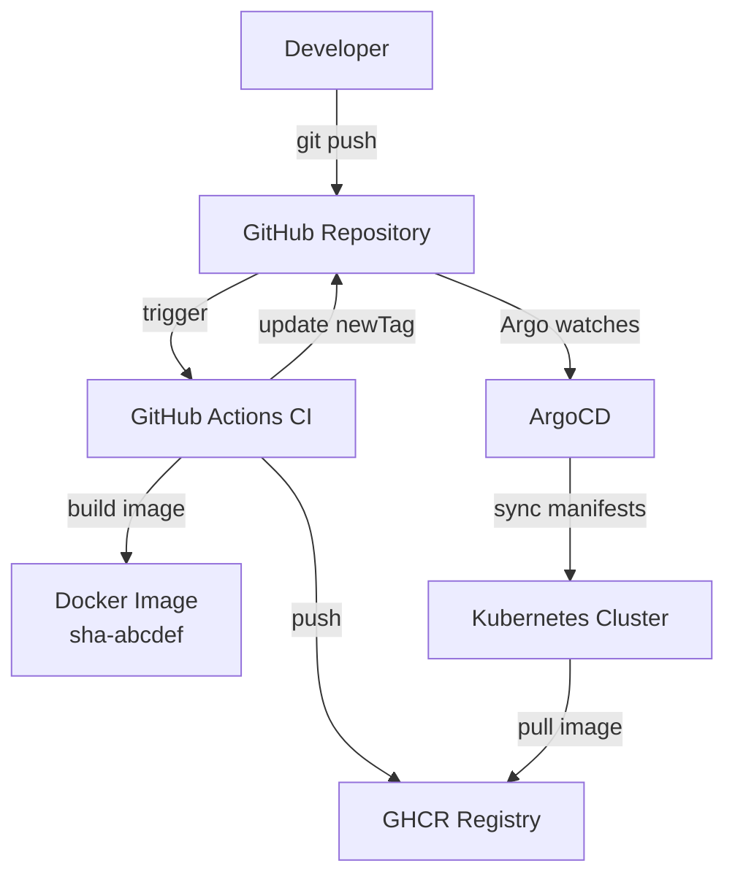

# Overview

This repository implements a fully automated GitOps-based continuous deployment pipeline for the ops-journal application.

The system is composed of:

* Application source code
* Container build pipeline
* Container registry (GHCR)
* Kubernetes manifests (Kustomize)
* ArgoCD for reconciliation
* Minikube cluster (runtime)

The deployment model is fully declarative and pull-based.

# High-Level flow

```
Developer → git push
              ↓
        GitHub Actions (CI)
              ↓
     Build Docker image (immutable SHA tag)
              ↓
     Push image to GHCR
              ↓
     Update Kustomize overlay (newTag)
              ↓
     Commit back to main
              ↓
        ArgoCD detects drift
              ↓
     Kubernetes pulls image
              ↓
         New Pod rollout
```

# Components

## 1. Application Layer

Repository contains:

* MkDocs-based static site
* Dockerfile (multi-stage build)
* GitHub Actions workflow

The Docker image is built in CI only. No local or cluster-side builds occur.

## 2. CI Layer (GitHub Actions)

The pipeline:

1. Triggers on push to `main`
2. Builds container image
3. Tags image as:
    * `sha-<short-sha>`
    * `latest`
4. Pushes to GitHub Container Registry (GHCR)
5. Updates the `newTag` field in the dev overlay
6. Commits the change back to `main`

Permissions:

```yaml
permissions:
  contents: write
  packages: write
```

The workflow avoids infinite loops by skipping execution when triggered by `github-actions[bot]`.

## 3. Artifact Layer (GHCR)

Images are stored at:

```
ghcr.io/plasterinho/ops-journal
```

Tagging strategy:

* immutable SHA-based tags (`sha-abcdef1`)
* `latest` for convenience
* Deployments use SHA tags only

This guarantees traceability between commit and running workload.

## 4. Configuration Layer (Kustomize)

Structure:

```
workloads/
  ops-journal/
    base/
    overlays/
      dev/
```

* Base defines structural Deployment and Service
* Overlay injects environment-specific parameters (image tag, replicas)

Image tag is managed via:

```yaml
images:
  - name: ghcr.io/plasterinho/ops-journal
    newTag: sha-<short-sha>
```

## 5. Gitops Layer (ArgoCD)

ArgoCD:

* Watches repository
* Path: `environments/local`
* Automated sync enabled
* Self-heal enabled
* Prune enabled

Argo reconciles desired state from Git with cluster state continuously.

There is no imperative deployment step.

## 6. Runtime Layer (Kubernetes/Minikube)

Cluster characteristics:

* Single-node Minikube
* Pulls images directly from GHCR
* No local image loading
* No SSH-based deployment steps

Deployment updates are triggered exclusively by manifest changes in Git.

# Deployment Model

This implementation currently represents **Continuous Deployment**:

* Every commit to `main` results in:
    * New image build
    * Automatic manifest update
    * Automatic cluster rollout

There is no approval gate at this stage.

# Architectural Properties

## Deterministic

Each deployment corresponds to an immutable image tag derived from a commit SHA.

## Pull-Based

Kubernetes pulls images from a registry. No image builds occur on cluster nodes.

## Declarative

Cluster state is fully defined in Git.

## Self-Mutating Repository

The CI pipeline updates deployment manifests within the same repository. This will be refactored in future iterations to separate application and infrastructure concerns.

# Known Limitations

* Application and infrastructure definitions reside in the same repository.
* CI mutates deployment manifests directly.
* No promotion workflow or approval gate.
* Single-environment deployment model.

These limitations will be addressed in subsequent architectural evolution phases.

# Current Maturity Level

This system represents:

* Functional GitOps implementation
* Fully automated CI/CD pipeline
* Registry-backed immutable deployments
* Declarative Kubernetes configuration

It serves as the baseline architecture for further enterprise-grade refinement.

## System Diagram


