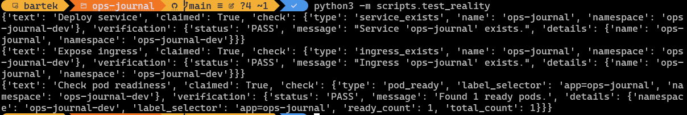
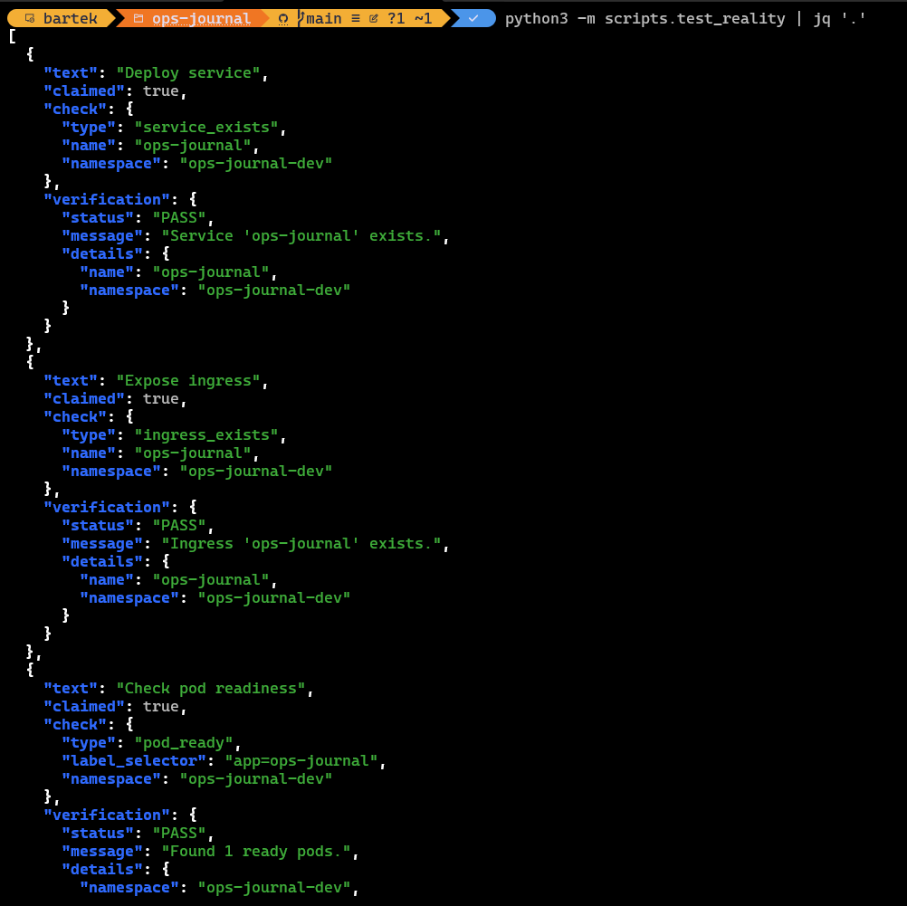
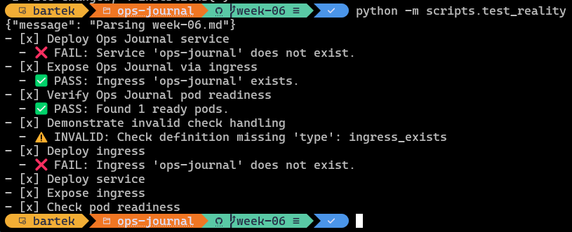

# Week 6 - Reality Checks

> Theme: "Don't lie to yourself."

## Goals

This week introduces automated verification of system state. Until now, tasks were marked as complete based on intent. Now, the system verifies whether that intent matches actual cluster state.

----------

## Tasks

- [x] Deploy Ops Journal service <!-- id: deploy-service -->
- [x] Expose Ops Journal via ingress <!-- id: expose-ingress -->
- [x] Verify Ops Journal pod readiness <!-- id: pod-ready -->
- [x] Demonstrate invalid check handling <!-- id: invalid-check -->

----------

## Notes

- Verification is performed against the Kubernetes API.
- Checks are read-only and use a dedicated service account (in-cluster) or kubeconfig (local).
- Results reflect **actual cluster state**, not declared intent.

### First principle: Separate Three Worlds

Right now we have slightly mixed concerns. These need to be explicitly separated:

```text
Git (desired state)
        │
        ▼
Ops Journal Renderer
        │
        ▼
Reality Check Engine
        │
        ▼
Kubernetes Cluster (observed state)
```

### Component responsibilities

| Component | Responsibility |
| --- | --- |
| Git | task declarations |
| Renderer | parse tasks and render UI |
| Reality Engine | verify cluster facts |
| Cluster | source of truth |

Key idea:

> The Reality Engine never edits anything. It only observes.

## High-level Architecture

A minimal but extensible structure:

```text
ops-journal
│
├─ journal/
│   ├─ parser.py
│   └─ models.py
│
├─ reality/
│   ├─ engine.py
│   ├─ checks/
│   │   ├─ service_exists.py
│   │   ├─ ingress_exists.py
│   │   └─ pod_ready.py
│   │
│   └─ kube_client.py
│
├─ ui/
│   └─ renderer.py
│
└─ main.py
```

Conceptually:

```text
Markdown (claims) + YAML (checks)
        │
        ▼
Merged tasks
        │
        ▼
Reality Engine
        │
        ▼
Kubernetes Cluster (truth)
```

## Core concept: Checks

Every verification is defined in YAML and mapped to a pluggable check.

Example task in `markdown`:

```markdown
- [x] Deploy ingress for Staging environment <!-- id: deploy-ingress -->
```

and its counterpart in `yaml`:

```yaml
- id: deploy-ingress
  check:
    type: ingress_exists
    name: ops-journal
    namespace: ops-journal-staging
```

The engine translates that to:

```text
run check "ingress_exists"
with params {name, namespace}
```

## The Reality Engine

Central coordinator.

Responsibilities:

1. Receive task list
2. Attach checks
3. Dispatch check plugins
4. Return verification results

Conceptually:

```python
for task in tasks:
    if task.get("check"):
        result = run_check(task["check"])
```

## Check Plugin Interface

All checks follow the same contract.

```text
check(context, params) -> Result
```

```text
Result
    status: PASS | FAIL | INVALID
    message: string
```

Examples:

```text
PASS: "Ingress ops-journal exists"
FAIL: "Ingress not found"
INVALID: "Missing required field 'type'"
```

## Kubernetes Access Layer

Avoid embedding `kubectl` everywhere. We create one adapter `kube_client.py`, with limited responsibilities:

```python
get_service(name, namespace)
get_ingress(name, namespace)
get_pods(selector)
```

Checks call the client instead of raw commands.

## Caching Layer

We do not want to hit the API for every page render.

Simple model:

```text
Reality Engine refresh interval: 30s
```

Flow:

```text
request -> UI
        -> uses cached verification results
```

Background job:

```python
refresh_checks()
```

## UI Data Model

```text
Task
 ├─ text
 ├─ claimed
 ├─ id
 └─ verification
      ├─ status
      └─ message
```

## Minimal Check Set for Week 6

### Service Exists

```yaml
type: service_exists
params:
  name
  namespace
```

### Ingress Exists

```yaml
type: ingress_exists
params:
  name
  namespace
```

### Pod Ready

```yaml
type: pod_ready
params:
  label_selector
  namespace
```

----------

## Evidence

Example verification output:

```text
- [x] Deploy Ops Journal service
  - ❌ FAIL: Service 'ops-journal' does not exist.
- [x] Expose Ops Journal via ingress
  - ✅ PASS: Ingress 'ops-journal' exists.
- [x] Verify Ops Journal pod readiness
  - ✅ PASS: Found 1 ready pods.
- [x] Demonstrate invalid check handling
  - ⚠️ INVALID: Check definition missing 'type': {'name': 'ingress_exists', 'namespace': 'default'}
```

- Failed check


- Passing check



- Using the output to feed into a rendering engine



- Final check format



----------

## Reflection

This is the first point where the system can contradict the user. A task marked as complete is no longer trusted by default — it must be verified.

```text
Git -> Declared state
System -> Observed state
```

The gap between them becomes visible.

----------

## Why this structure works

### 1. Tasks are now executable

```text
Markdown -> executable specification
```

Our Markdown files are no longer just documentation — they describe something that can be verified.

### 2. Checks live where they belong

Checks are defined separately in YAML, which removes parsing ambiguity and keeps responsibilities clear.

## Retrospective

Week 6 introduced a shift from declaring intent to verifying reality. This sounds straightforward, but the implementation exposed a few important lessons.

### 1. Parsing mixed formats is harder than it looks

The initial approach embedded YAML inside Markdown. While convenient on paper, it created ambiguity in parsing:

- indentation mattered in subtle ways  
- YAML blocks could bleed into other tasks  
- debugging parser issues was time-consuming  

At some point, more effort was spent handling edge cases than building actual functionality.

The solution was to separate concerns:

- Markdown → human-readable tasks  
- YAML → machine-readable checks  

This simplified the parser significantly and removed an entire class of bugs.

----------

### 2. Explicit contracts beat convenience

There was a temptation to introduce shorthand checks like:

```yaml
check: ingress_exists
```

This would require implicit defaults (name, namespace), which quickly leads to unclear behavior.

Instead, checks now require explicit structure:

```yaml
check:
  type: ingress_exists
  name: ops-journal
  namespace: ops-journal-dev
```

This makes the system more predictable and easier to debug.

----------

### 3. Not all failures are equal

A key distinction emerged between different types of failure:

- **PASS** → system state matches expectation  
- **FAIL** → system state contradicts expectation  
- **INVALID** → input is malformed  

Handling INVALID separately prevents bad input from being interpreted as a real system failure.

----------

### 4. Separation of concerns makes everything simpler

The system now has clear boundaries:

- Markdown → what is claimed  
- YAML → how to verify it  
- Reality Engine → executes checks  
- Kubernetes → source of truth  

Each component has a single responsibility, which made the system easier to reason about.

----------

### 5. The system can now contradict the user

This is the first point where the system is no longer passive.

A task marked as complete is no longer trusted—it must be verified.

```text
Git -> Declared state
System -> Observed state
```

The gap between them is now visible.

----------

### 6. Small structure decisions matter later

Adding:

- required fields per check  
- consistent result messages  
- structured `details` alongside human-readable messages  

seems minor, but these decisions make the system easier to extend without refactoring.

----------

### Summary

This week was less about Kubernetes and more about system design.

The biggest shift was moving from:

```text
"Does the code run?"
```

to:

```text
"Does the system describe and verify reality correctly?"
```
