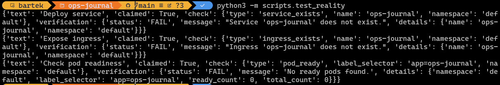

# Week 6 - Reality checks

> theme: "Don't lie to yourself."

## Goals

This week introduces automated verification of system state. Until now, tasks were marked as complete based on intent. Now, the system verifies whether that intent matches actual cluster state.

----------

## Tasks

- [x] Deploy Ops Journal service
  check:
    type: service_exists
    name: ops-journal
    namespace: ops-journal

- [x] Expose Ops Journal via ingress
  check:
    type: ingress_exists
    name: ops-journal
    namespace:ops-journal-dev

- [x] Verify Ops Journal pod readiness
  check:
    type: pod_ready
    label_selector: app=ops-journal
    namespace: ops-journal-dev

----------

## Notes

- Verification is performed against the Kubernetes API.
- Checks are read-only and use a dedicated service account (in-cluster) or kubeconfig (local).
- Results reflect **actual cluster state**, not declared intent.

### First principle: Separate Three Worlds

Right now we have slightly mixed concerns. These need to beexplicitely separated:

```text
Git (desired state)
        │
        ▼
Ops Journal Renderer
        │
        ▼
Reality Check Engine
        │
        ▼
Kubernetes Cluster (observed state)
```

Responsibilities:

### Component responsibilities

| Component | Responsibility |
| --- | --- |
| Git | task declarations |
| Renderer | parse tasks and render UI |
| Reality Engine | verify cluster facts |
| Cluster | source of truth |

Key Idea:

> The Reality Engine never edits anything. It only observes.

## 2. High-level Architecture

A minimal but extensible structure:

```text
ops-journal
│
├─ journal/
│   ├─ parser.py
│   └─ models.py
│
├─ reality/
│   ├─ engine.py
│   ├─ checks/
│   │   ├─ service_exists.py
│   │   ├─ ingress_exists.py
│   │   └─ pod_ready.py
│   │
│   └─ kube_client.py
│
├─ ui/
│   └─ renderer.py
│
└─ main.py
```

Conceptually:

> tasks -> reality engine -> check plugins -> kubernetes

### 3. Core concept: "Checks"

Every verification should be a **pluggable check**.

Example task in markdown:

```yaml
- [x] Deploy ingress
  check: ingress_exists
  name: ops-journal
  namespace: default
```

The engine translates that to:

```text
run check "ingress_exists"
with params {name, namespace}
```

Which maps to a plugin.

### 4. The Reality Engine

Central coordinator.

Responsibilities:

1. Receive task list
2. Identify tasks with checks
3. Dispatch check plugins
4. Return verification results

Conceptually:

```python
for task in tasks:
    if task.check:
        result = run_check(task.check, task.params)
```

Output structure:

```json
{
    "task": "Deploy ingress",
    "claimed": true,
    "verified": true,
    "details": "Ingress found"
}
```

This structure goes to the renderer.

### 5. Check Plugin Interface

All checks should follow the same contract.

Example interface:

```text
check(context, params) -> Result
```

Where:

```text
Result
    status: PASS | FAIL | UNKNOWN
    message: string
```

Example:

```text
PASS: "Ingress ops-journal exists"
FAIL: "Ingress not found"
```

The important bit: this is extensible. Later we can add checks like:

- TLS certificate present
- Deployment replicas healthy
- ArgoCD app synced
- Endpoint reachable

Without changing the engine.

### 6. Kubernetes Access Layer

Avoid embedding `kubectl` everywhere. We create one adapter `kube_client.py`, which has very limited, but useful responsibilities:

```python
get_service(name, namespace)
get_ingress(name, namespace)
get_pods(selector)
```

Our checks call the client instead of raw commands. This will give us future flexibility when we decide to create a REST API.

### 7. Caching Layer

**Important - we do not want to hit the API for every page render**.

Simple model:

```text
Reality Engine refresh interval: 30s
```

Flow:

```text
request -> UI
        -> uses cached verification results
```

Background job:

```python
refresh_checks()
```

This avoids sending a large number of `kubectl` calls on every UI refresh.

### 8. UI Data Model

Extend the task model:

```text
Task
 ├─ text
 ├─ claimed
 ├─ check_type
 ├─ check_params
 └─ verification
      ├─ status
      └─ message
```

Which renders like:

```text
Deploy ingress
✔ Claimed
✔ Verified by cluster
```

or

```text
Deploy ingress
✔ Claimed
✖ Cluster does not contain ingress
```

### 9. Minimal Check Set for Week 6

We'll start with just three checks.

#### 1. Service Exists

```text
service_exists
params:
  name
  namespace
```

#### 2. Ingress Exists

```text
ingress_exists
params:
  name
  namespace
```

#### 3. Pod Ready

```text
pod_ready
params:
  label_selector
  namespace
```

This gives us meaningful verification. We could write much, much more, but right now the focus is on the Reality Engine, not doing everything.

----------

## Evidence

Example verification output:

```text
- [x] Deploy service
  - ✅ PASS: Service 'ops-journal' exists.
- [x] Expose ingress
  - ✅ PASS: Ingress 'ops-journal' exists.
- [x] Check pod readiness
  - ✅ PASS: Found 1 ready pods
```

Testing reality engine:

- Failed check


- Passing check


- Using the output to feed into a rendering engine
![Terminal output showing Reality Engine verification results piped through jq JSON formatter, displaying three successful checks: Service ops-journal exists in namespace ops-journal, Ingress ops-journal exists in namespace ops-journal-dev, and Pod with label selector app=ops-journal is ready in namespace ops-journal-dev. Each result shows status PASS with green checkmarks and detailed messages. The jq output demonstrates how verification data flows from the Reality Engine into downstream rendering systems](evidence/week-06/s03-passed-checks-with-jq.png)

----------

## Reflection

This is the first point where the system can contradict the user. A task marked as complete is no longer trusted by default -- it must be verified. This introduces a new feedback loop:

```text
Git -> Declared state
System -> Observed state
```

And the gap between them becomes visible.

----------

## Why this structure works

### 1. Tasks are now executable

We've turned:

```text
Markdown -> Documentation
```

into:

```text
Markdown -> executable specification
```

Our Markdown files aren't just walls of text for the reader to imagine what is going on - they feel alive now.

### 2. Checks live where they belong

We decided that the check lives next to the task.
