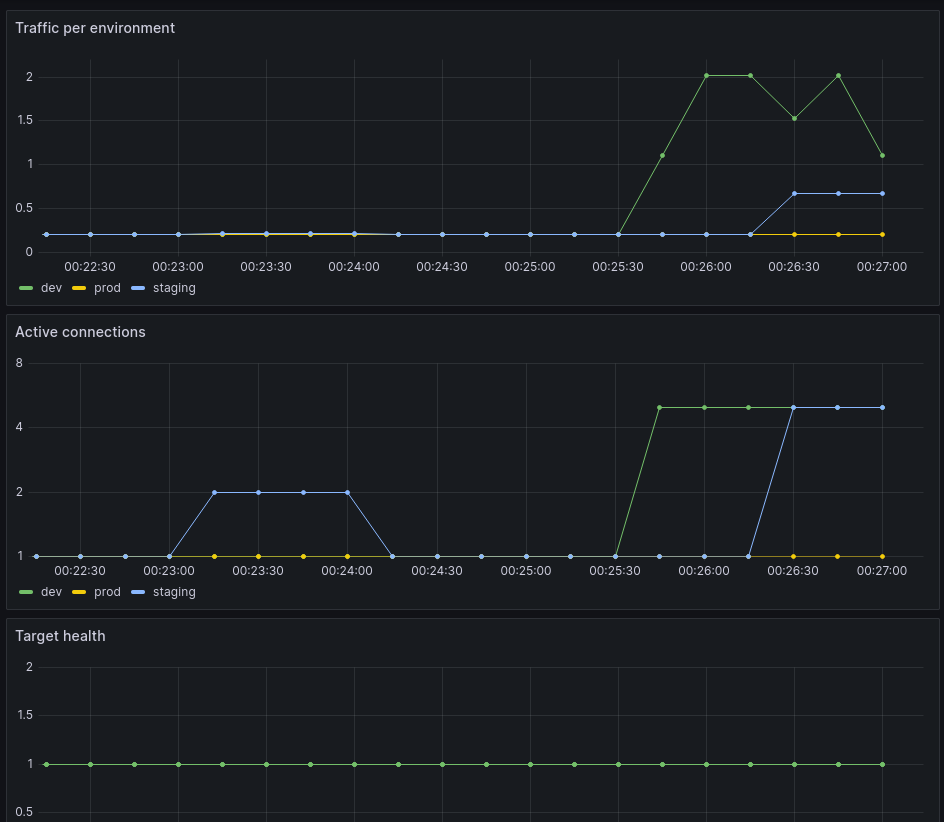

# Week 07 — Observability + GitOps Convergence (Final)

## Goals

We have automated verification of system state. This week, we bring observability under GitOps control while preserving those checks.

## Tasks

- [x] Prometheus is deployed from Git <!-- id: deploy-prometheus -->
- [x] Grafana is deployed from Git <!-- id: deploy-grafana -->
- [x] The Prometheus datasource, the Observability dashboard, and all its panels are configured in Git <!-- id: deploy-dashboards -->
- [ ] System checks from Week 6 are exposed as Prometheus metrics <!-- id: system-metrics -->
- [x] Additional task: ClusterConfig includes a bootstrap loaded directly from Git, with no need to clone the repository <!-- id: bootstrap -->

## Evidence

Grafana dashboard with working panels (including metrics reflecting system state and checks)

## Summary

Week 07 solidified the platform’s transition from “things running in Kubernetes” to a self-configuring, Git-driven system.

The core achievement is that observability is now fully declarative:

- Prometheus deployment is managed from Git  
- Grafana deployment, datasources, dashboards, and panels are all defined in Git  
- ArgoCD continuously reconciles the desired state  

In parallel, bootstrap was refined into a repeatable entry point: a minimal script that installs ArgoCD and hands over control to GitOps via a root application.

At this point, the system can be recreated from scratch with:

bootstrap → ArgoCD → full platform state

---

## What Was Built

### 1. Fully GitOps-managed observability

The observability stack is now entirely defined in the repository:

- Prometheus (deployment + config)
- Grafana (deployment + ingress)
- Grafana datasources (ConfigMap)
- Grafana dashboards and panels (JSON → ConfigMap → provisioning)

This removed all manual UI configuration.

Result:

Observability = code, not clicks

---

### 2. Grafana provisioning pipeline

A complete pipeline was established:

Git (JSON dashboards)
→ ConfigMap
→ mounted into Grafana
→ provisioning config
→ dashboards available in UI

Key fixes along the way:

- corrected volume mounts (YAML structure issue)
- ensured ConfigMaps exist before pod startup
- resolved datasource placeholders (__inputs → static datasource)
- validated JSON formatting

Outcome:

Dashboards are reproducible and version-controlled

---

### 3. Prometheus integration

Prometheus is now:

- deployed declaratively
- accessible within the cluster
- wired as a Grafana datasource via provisioning

This enables dashboards to work without any manual wiring.

---

### 4. ArgoCD bootstrap and root application

Bootstrap flow:

1. Create namespace
2. Install ArgoCD (server-side apply)
3. Wait for readiness
4. Apply root application

The root application points to the repo and recursively defines all apps.

This establishes:

kubectl → bootstrap only  
ArgoCD → owns the platform

---

### 5. Bootstrap reliability improvements

Enhancements included:

- Kubernetes version alignment (v1.35.1)
- handling CRD apply issues via server-side apply
- fixing missing application paths in bootstrap
- improving Minikube compatibility
- enabling a no-clone bootstrap path

Goal achieved:

One command → working cluster → self-managed state

---

## Observability → SLO (first step)

A first, pragmatic SLO was introduced based on available metrics.

Given only NGINX exporter metrics:

rate(nginx_http_requests_total[5m])

The SLO is defined as:

Service is considered available if it processes requests continuously.  
Target: 99% of time windows have non-zero request rate.

This is intentionally simple, but establishes:

Observability → expectations → measurable health

---

## Problems Encountered

### 1. ArgoCD instability

- missing argocd-secret
- Dex crash loops
- repo-server failing due to non-idempotent ln -s

Resolution:

- reset namespace when needed
- vendor install manifest
- remove problematic copyutil initContainer

Key lesson:

Installation manifests are not always safe to treat as black boxes

---

### 2. GitOps vs manual changes

Applying changes via kubectl led to confusion due to ArgoCD reconciliation.

Takeaway:

Git is the only source of truth once ArgoCD is active

---

### 3. Grafana provisioning pitfalls

Issues included:

- missing volume mounts due to YAML structure
- pods stuck in ContainerCreating due to missing ConfigMaps
- invalid JSON dashboards
- unresolved datasource placeholders

Takeaway:

Declarative config increases reliability, but reduces tolerance for mistakes

---

### 4. Local networking limitations

Attempts to expose services via MetalLB were inconsistent due to:

- Minikube Docker driver
- host networking constraints
- WSL interaction

Final approach:

- use SSH/X11 or port-forwarding for access
- accept local networking as “good enough”

---

### 5. Metrics limitations

Available metrics were limited to NGINX exporter (no status codes or latency).

Implication:

SLOs are currently infrastructure-level, not request-level

---

## Current State

The platform now supports:

- reproducible cluster bootstrap
- ArgoCD-managed application lifecycle
- fully declarative observability stack
- Grafana dashboards and datasources from Git
- basic SLO definition

All core components are:

version-controlled + automatically reconciled

---

## What Changed Conceptually

This week marked a transition:

From:

Deploying tools

To:

Designing a platform that maintains itself

Key shifts:

- imperative → declarative
- UI configuration → Git configuration
- “is it running?” → “is it meeting expectations?”

---

## Next Steps

Natural continuation areas:

- richer SLOs (status codes, latency)
- alerting (Alertmanager)
- environment separation (dev/prod overlays)
- ArgoCD self-management (Argo managing its own install)
- improving local networking or moving to a more realistic environment

---

## Reflection

This week involved a lot of friction:

- YAML structure issues
- GitOps reconciliation surprises
- networking inconsistencies
- brittle installation defaults

But those issues exposed the real constraints of operating a platform.

The outcome is significant:

The system is now coherent, reproducible, and largely self-managing

That’s a solid foundation to build on.
